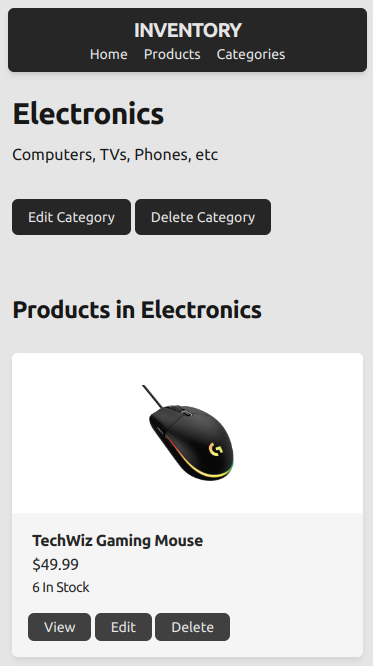

# Odin Project #27: Inventory Application (Express, MongoDB)

Welcome to Bryan Miller's Mini Message Board, the [twenty seventh assignment](https://www.theodinproject.com/lessons/nodejs-inventory-application#solutions) within the Odin Project curriculum. The goal of this repo is to practice the following skill sets:

- MVC: Model View Controller pattern
- Express
- MongoDB / Atlas
- Mongoose
- EJS
- TailwindCSS
- Fly.io PaaS
  - Instances
  - Persistent Storage Volume Mount
  - SSL with custom domain
  - DNS records
- Additional Packages
  - `multer`: file upload handling
  - `compression`: adds gzip compression
  - `helmet`: adds vulnerability protection
  - `express-rate-limit`: prevents brute force attacks
  - `express-async-handler`: wraps our route callbacks in try/catch blocks & handles errors
  - `express-validator`: execute validation on `req.body` variables, passed via `POST` requests / form data
  - `dotenv`: environmental variable handling (db connection string)

## Links

- [Live Demo](https://inventory.bmilcs.com)
- [My Odin Project Progress](https://github.com/bmilcs/odin-project)

## Summary

The Inventory Project is a full stack web application that utilizes Express, MongoDB, EJS and the MVC pattern. Express is a NodeJS framework, MongoDB is a document-based non-relational database and EJS is a template engine.

The database Schemas are as follows:


### High Level Breakdown

- Clients enter in a URL
- The URL is matched to an HTTP route & verb, defined in `app.js` and then passed to a module within the `/routes` directory
- Routes pass the `req` data to a controller middleware function, defined in `/controllers`
- Controller functions process the request. They determine the flow of the application, executing a combinations of the following tasks depending on the request:
  - Validate form data from `POST` requests
  - Perform CRUD operations in the database: create/read/update/delete
  - Fill out variables in our templates (`/views`) and sends the result back to the client

### Deployment Notes

This project was deployed to `fly.io` using their CLI tool `flyctl`. The following steps were taken:

- Initialized a new project
- Deployed the project
- Pushed MongoDB connection string to a `secret`
- Issued an SSL certificate request for custom domain
- Created CNAME record in Cloudflare
- Reduced deployment to a single instance or machine to prevent charges
- Profit

### Problems Overcome

Unfortunately, image file uploads did not work using a standard deployment. After some research, I realized a persistent storage volume was the solution. Using the CLI, I:

- Created a 1GB storage volume in the same location as my single machine/instance
- Connected to the instance via SSH using `flyctl`
- Located the path to `/public/images` within the instance's underlying operating system
- Added the mount information to `fly.toml`:
  ```toml
  [mounts]
    source="bmilcs_inventory"
    destination="/app/public/images"
  ```
- Deployed the project once again

While developing the file upload system, it became apparent that uploads were going to pile up quickly. To solve this issue, `fs.unlink` was utilized to delete the old image file when a new one was uploaded.

Another issue that I had to solve was handling invalid IDs passed as a parameter to a URL. Whenever an invalid ID was passed as a URL parameter, MongoDB would complain of an invalid `ObjectId` and it would stop controller functions from reaching custom error handling. To solve this issue, I added the following checks to prevent unnecessary DB calls & to issue the proper error handling:

```js
// return the results of a db query if a valid ObjectID is passed
// otherwise, return null
const product = mongoose.Types.ObjectId.isValid(productId)
  ? await Product.findById(productId).exec()
  : null;

// product not found: throw an error
if (product === null) {
  const err = new Error("Product not found");
  err.status = 404;
  return next(err);
}
// ...
```

### Final Notes

Aesthetics were not a top priority for this project. However, Tailwind is a great CSS framework and I can understand its popularity, particularly in a component based project. Responsive design is easily achieved using mobile first design and prepending prefixes such as `md:` or `lg:` to override CSS rules on larger screen sizes. In this particular use case, I wanted the practice and Tailwind made creating a simple interface a quick endeavor.

Full stack development is a blast and I'm excited to create more projects using both the frontend and backend. Authentication is coming up soon in the next Odin Project lesson and I can't wait to create something unique and meaningful in the near future.

## Screenshots





## Deployment

```sh
# clone repo & change directories
git clone https://github.com/bmilcs/odin-inventory
cd odin-inventory

# install dependencies
npm install
```

This project requires a database connection string from MongoDB Atlas to run locally:

1. Rename `.env.example` to `.env`
2. Paste connection string into `.env`

```sh
# run locally
npm run dev

# compile tailwind css changes during development:
npm run css
```
